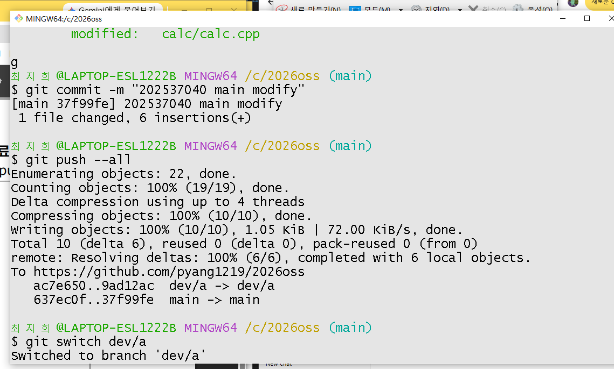
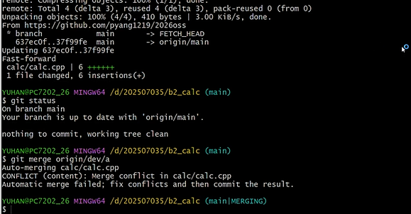
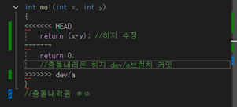
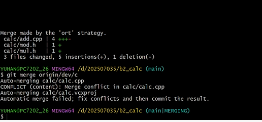
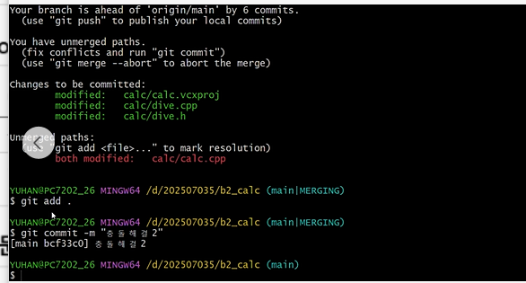
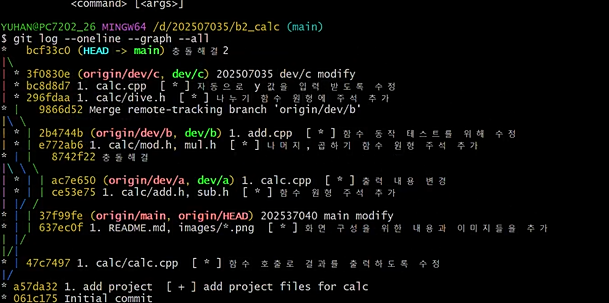
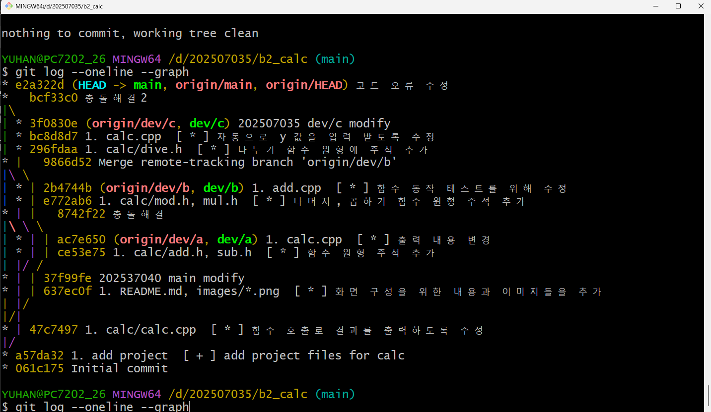
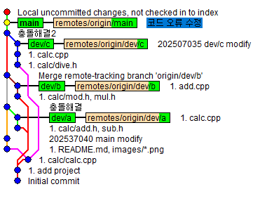
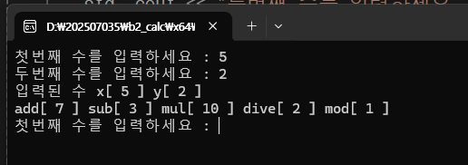

# calc

## oss 기말 프로젝트

저장소 : https://github.com/pyang1219/2026oss

| 팀원(역할) | 업무 |
| :--- | :--- |
| 김세린(202507035) | dev/c 브랜치와 ReadMe.md 수정 |
| 최지희(2025) | main, dev/a 브랜치와 main 수정 |
| 최예은(2024) | dev/b 브랜치와 |

## 문제해결 방법과 순서

1. 팀원들 각자 코드 수정하고 commit 후 push하는 과정
2. 팀원들 다 푸쉬한다음 팀장이 메인에서 dev/a 병합하는데 충돌발생
2. 코드 충돌 해결 main과 dev/a
3. dev/b merge하고 dev/c하는데 충돌발생
4. 코드 수정 후 2번째 충돌 해결
5. 충돌 해결2한다음 log
6. 마지막으로 main에서 코드 실행시 발생하는 문제 수정 후 최종 커밋
7. 최종 실행 결과

## git flow:결과화면

## 프로그램 실행 결과 화면

